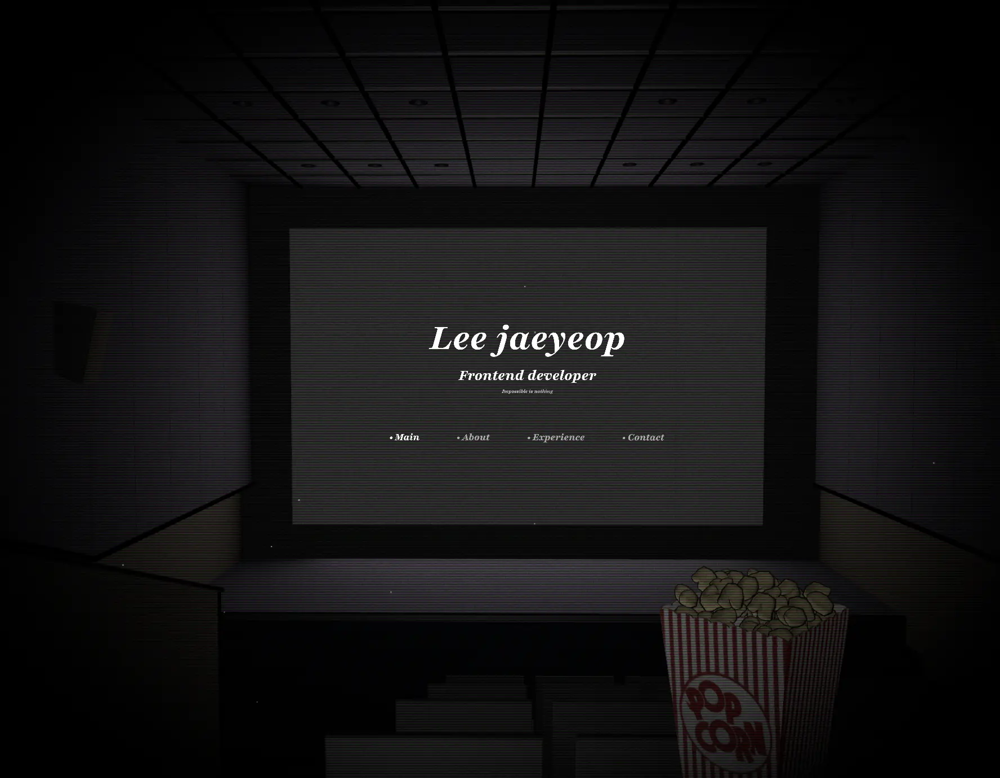

# 🧑‍💻 3D Portfolio with React Three Fiber

https://leejaeyeop-blog.vercel.app/



## 📌 Introduction

React Three Fiber와 Three.js를 기반으로 제작된 3D 인터랙티브 포트폴리오입니다. 영화관 에서 저의 이야기를 상영해주는 컨셉으로 제작 되었습니다. 기술, 프로젝트, 경험을 시각적으로 매력적인 방식으로 표현하기 위해 제작되었으며, WebGL 기반의 고성능 렌더링과 React 생태계를 적극 활용했습니다.

## 🛠️ 주요 기술 스택

- React 컴포넌트 기반 UI 개발
- React Three Fiber Three.js를 React 방식으로 사용
  Drei react-three-fiber의 유틸리티 라이브러리 (카메라 컨트롤, 환경맵 등)
- Rapier 물리 엔진으로 충돌, 중력 등 3D 상호작용 처리
- Framer Motion 부드러운 애니메이션 및 섹션 전환

## 🚀 Getting Started

1. install Dependencies:

```bash
pnpm install
```

2. Run the Next.js Development Server

```bash
pnpm dev
```
